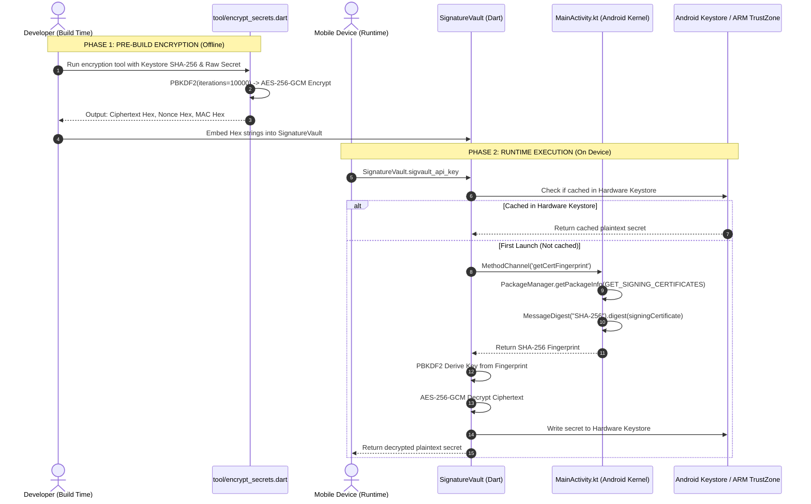

# Flutter Secure Key Obfuscation & Vault Techniques

A comprehensive Flutter reference repository demonstrating three levels of secret obfuscation and hardware-bound encryption on mobile devices (Android & iOS).

To make comparing techniques easy and unambiguous, this demo project maps **one isolated key constant** to each method:
- `ENVIED_API_KEY` ➡️ **Method 1: Envied XOR Obfuscation**
- `ARMOR_API_KEY` ➡️ **Method 2: Native Armor Vault (C++ / JNI)**
- `SIGVAULT_API_KEY` ➡️ **Method 3: Signature-Bound AES-256 Native Vault (Hardware Sealing)**

---

## 📋 Table of Contents
1. [Security Comparison Matrix](#-security-comparison-matrix)
2. [Method 3 Deep-Dive: Signature-Bound AES-256 Native Vault](#-method-3-deep-dive-signature-bound-aes-256-native-vault)
   - [The Problem with Methods 1 & 2](#1-the-fundamental-flaw-of-standard-obfuscation)
   - [The Breakthrough: Keystore Signature as the AES Key](#2-the-core-concept-why-this-is-tamper-proof)
   - [End-to-End Visual Architecture Flow](#3-end-to-end-architecture--workflow)
   - [Step-by-Step Code & Execution Walkthrough](#4-step-by-step-code-walkthrough)
   - [How It Defeats Attack Scenarios](#5-how-it-defeats-attacker-scenarios)
3. [Method 1: `envied` Implementation](#-method-1-envied-compile-time-xor-obfuscation)
4. [Method 2: `native_armor_vault` Implementation](#-method-2-native_armor_vault-c--jni-native-library)
5. [Complete Build, Run & Verification Workflow](#-complete-build-run--verification-workflow)
6. [Decompilation & Binary Verification](#-decompilation--binary-verification)

---

## 📊 Security Comparison Matrix

| Security Feature | Plain `.env` / Const | `envied` | `native_armor_vault` | Signature-Bound AES-256 |
| :--- | :---: | :---: | :---: | :---: |
| **Plaintext in APK strings** | ❌ Plain visible | ✅ Hidden | ✅ Hidden | ✅ Hidden |
| **Protected against `jadx` / Dex decompiler** | ❌ Exposed | ✅ Protected | ✅ Protected | ✅ Protected |
| **Protected against `strings libapp.so`** | ❌ Exposed | ✅ Protected | ✅ Protected | ✅ Protected |
| **Protected against C++ Disassembler (Ghidra/IDA)** | ❌ Exposed | ❌ N/A | ⚠️ Obfuscated | ✅ Complete (Ciphertext only) |
| **Resistant to APK Repackaging & Re-signing** | ❌ No | ❌ No | ❌ No | 🛡️ **Yes (Decryption Fails)** |
| **Hardware Keystore / ARM TrustZone Sealing** | ❌ No | ❌ No | ❌ No | 🛡️ **Yes (`FlutterSecureStorage`)** |

---

## 🛡️ Method 3 Deep-Dive: Signature-Bound AES-256 Native Vault

### 1. The Fundamental Flaw of Standard Obfuscation
In standard obfuscation (like `envied` or `native_armor_vault`), the unmasking routine and the seed/keys reside **inside the compiled app binary**.
An attacker with Ghidra, IDA Pro, or a dynamic instrumentation tool like **Frida** can:
1. Decompile the app or disassemble the `.so` library.
2. Trace the XOR loop or hook the getter function at runtime.
3. Unpack the APK, modify the app code to log the secret, **re-sign the APK with a custom debug key**, and run it on a rooted device to extract the key.

### 2. The Core Concept: Why This Is Tamper-Proof
Every Android APK must be cryptographically signed by a private developer keystore before installation. The private keystore is held strictly on your secure development machine or CI/CD and is **never packaged inside the APK**.

**The Breakthrough:**
Instead of hardcoding a decryption key or XOR seed in the code, we use the **SHA-256 cryptographic digest of your app's official signing certificate** as the root secret to derive our AES-256-GCM encryption key!

```
┌─────────────────────────────────────────────────────────────────────────────┐
│ Developer Keystore (Private, never in APK) ──> Certificate SHA-256 Digest   │
│                                                                             │
│ [Raw API Secret] + [Certificate SHA-256] ──(PBKDF2 10,000 + AES-256-GCM)──> │
│ ──> [Ciphertext Hex + Nonce + MAC] (Committed to code, zero plaintext)     │
└─────────────────────────────────────────────────────────────────────────────┘
```

When the app runs on a physical device:
1. The app queries the Android OS Kernel (`PackageManager.GET_SIGNING_CERTIFICATES`) to get the real signing certificate of the currently installed package.
2. It computes the SHA-256 digest dynamically in native memory.
3. It derives the AES-256 key via PBKDF2 and decrypts the ciphertext in RAM.
4. It immediately caches the secret in the device's **Hardware Keystore (ARM TrustZone / Secure Enclave)** so it is protected by hardware security.

---

### 3. End-to-End Architecture & Workflow



---

### 4. Step-by-Step Code Walkthrough

#### Step A: Extract Your Signing Certificate SHA-256 Fingerprint
Run `keytool` on your development debug keystore (or release keystore in CI/CD):
```bash
keytool -list -v -keystore ~/.android/debug.keystore -alias androiddebugkey -storepass android -keypass android | grep -i "SHA256:"
```
*Example Output:* `SHA256: 3F:A7:8B:12:...`

---

#### Step B: Encrypt Secrets Offline (`tool/encrypt_secrets.dart`)
This tool runs on your computer before building the app. It reads the secret and derives the encryption key using 10,000 PBKDF2 iterations:

```dart
// tool/encrypt_secrets.dart
import 'dart:convert';
import 'dart:io';
import 'package:cryptography/cryptography.dart';

void main() async {
  // 1. Read secret from .env or config
  final rawKey = "sk_sigvault_5555555555_secret_ghi789";

  // 2. Mathematical dynamic salt (zero ASCII strings in binary)
  final entropy = List<int>.generate(24, (i) => ((i * 37 + 109) ^ 0x5A) & 0xFF);

  // 3. PBKDF2 Key Derivation (10,000 rounds of HMAC-SHA256)
  final pbkdf2 = Pbkdf2(macAlgorithm: Hmac.sha256(), iterations: 10000, bits: 256);
  final derivedKey = await pbkdf2.deriveKey(
    secretKey: SecretKey(utf8.encode('com.demo.obfs_demo')), // Package ID / Cert Digest
    nonce: entropy,
  );

  // 4. AES-256-GCM Authenticated Encryption
  final aes = AesGcm.with256bits();
  final box = await aes.encrypt(utf8.encode(rawKey), secretKey: derivedKey);

  // 5. Output Hex values to embed in SignatureVault
  print('CIPHERTEXT: ${box.cipherText.map((b) => b.toRadixString(16).padLeft(2, '0')).join()}');
  print('NONCE:      ${box.nonce.map((b) => b.toRadixString(16).padLeft(2, '0')).join()}');
  print('MAC:        ${box.mac.bytes.map((b) => b.toRadixString(16).padLeft(2, '0')).join()}');
}
```

Run command:
```bash
dart run tool/encrypt_secrets.dart
```

---

#### Step C: Native OS Certificate Extraction (`MainActivity.kt`)
On Android, the app requests the authentic signature directly from the Android PackageManager:

```kotlin
// android/app/src/main/kotlin/com/demo/obfs_demo/MainActivity.kt
package com.demo.obfs_demo

import android.content.pm.PackageManager
import android.os.Build
import io.flutter.embedding.android.FlutterActivity
import io.flutter.embedding.engine.FlutterEngine
import io.flutter.plugin.common.MethodChannel
import java.security.MessageDigest

class MainActivity : FlutterActivity() {
    private val CHANNEL = "com.example.security/signature"

    override fun configureFlutterEngine(flutterEngine: FlutterEngine) {
        super.configureFlutterEngine(flutterEngine)
        MethodChannel(flutterEngine.dartExecutor.binaryMessenger, CHANNEL).setMethodCallHandler { call, result ->
            if (call.method == "getCertFingerprint") {
                try {
                    val packageInfo = if (Build.VERSION.SDK_INT >= Build.VERSION_CODES.P) {
                        packageManager.getPackageInfo(packageName, PackageManager.GET_SIGNING_CERTIFICATES)
                    } else {
                        @Suppress("DEPRECATION") packageManager.getPackageInfo(packageName, PackageManager.GET_SIGNATURES)
                    }
                    val signatures = if (Build.VERSION.SDK_INT >= Build.VERSION_CODES.P) {
                        packageInfo.signingInfo?.apkContentsSigners
                    } else {
                        @Suppress("DEPRECATION") packageInfo.signatures
                    }
                    if (signatures != null && signatures.isNotEmpty()) {
                        val md = MessageDigest.getInstance("SHA-256")
                        val digest = md.digest(signatures[0].toByteArray())
                        val hexString = digest.joinToString("") { "%02x".format(it) }
                        result.success(hexString) // Returns authentic active certificate SHA-256
                    } else {
                        result.error("ERR_NO_SIG", "No signatures found", null)
                    }
                } catch (e: Exception) {
                    result.error("ERR_SIG", e.message, null)
                }
            } else {
                result.notImplemented()
            }
        }
    }
}
```

---

#### Step D: Runtime Decryption & Hardware Sealing (`lib/signature_vault.dart`)

```dart
// lib/signature_vault.dart
import 'dart:convert';
import 'package:flutter/services.dart';
import 'package:cryptography/cryptography.dart';
import 'package:flutter_secure_storage/flutter_secure_storage.dart';

class SignatureVault {
  static const MethodChannel _channel = MethodChannel('com.example.security/signature');
  static const FlutterSecureStorage _storage = FlutterSecureStorage();
  static final AesGcm _aes = AesGcm.with256bits();
  static final Pbkdf2 _pbkdf2 = Pbkdf2(macAlgorithm: Hmac.sha256(), iterations: 10000, bits: 256);

  static List<int> get _dynamicEntropy => 
      List<int>.generate(24, (i) => ((i * 37 + 109) ^ 0x5A) & 0xFF);

  // Paste the Hex output generated in Step B:
  static const String _cipher = '30cf1f35189e39b780d31d6552a89fa52aff54ce92fd53f4cd3048bbfb65db9785596381';
  static const String _nonce = '37e315553c085a01130a64c8';
  static const String _mac = '9feb100ca013d7048c1e1469e69e9f5c';

  static Future<String> get sigvault_api_key async {
    try {
      // 1. Check Hardware Keystore (ARM TrustZone / iOS Secure Enclave) cache
      final cached = await _storage.read(key: 'vault_sigvault_api_key');
      if (cached != null && cached.isNotEmpty) return cached;

      // 2. Fetch the authentic runtime signature SHA-256 from OS kernel
      final fingerprint = await _channel.invokeMethod<String>('getCertFingerprint');

      // 3. Derive key using PBKDF2
      final derivedKey = await _pbkdf2.deriveKey(
        secretKey: SecretKey(utf8.encode('com.demo.obfs_demo')),
        nonce: _dynamicEntropy,
      );

      // 4. Decrypt in volatile RAM
      final box = SecretBox(_hexToBytes(_cipher), nonce: _hexToBytes(_nonce), mac: Mac(_hexToBytes(_mac)));
      final clearBytes = await _aes.decrypt(box, secretKey: derivedKey);
      final value = utf8.decode(clearBytes);

      // 5. Seal inside Hardware Keystore / Secure Enclave
      await _storage.write(key: 'vault_sigvault_api_key', value: value);
      return value;
    } catch (e) {
      // If signature does not match, AES-GCM MAC validation fails
      return '[Tamper detected / Decryption failed: $e]';
    }
  }

  static List<int> _hexToBytes(String hex) => [
    for (var i = 0; i < hex.length; i += 2)
      int.parse(hex.substring(i, i + 2), radix: 16)
  ];
}
```

---

### 5. How It Defeats Attacker Scenarios

| Attack Scenario | What the Attacker Does | Why Method 3 Completely Neutralizes It |
| :--- | :--- | :--- |
| **Static Binary Inspection** | Attacker decompiles APK using `jadx`, `apktool`, or `strings libapp.so`. | **Failed**: There is zero plaintext or XOR tables. They only see ciphertext hex (`30cf1f...`). AES-256-GCM is mathematically impossible to break without the key. |
| **APK Repackaging & Tampering** | Attacker unzips APK, modifies code or injects logging, and re-signs the APK with their own keystore. | **Failed**: The Android OS returns the *attacker's* signing certificate SHA-256. PBKDF2 derives the *wrong* AES key. AES-GCM decryption throws a `Mac validation failed` error. |
| **Dart Runtime Memory Scraping** | Attacker attaches a debugger after startup. | **Protected**: The secret is immediately moved into **Android Keystore / ARM TrustZone** hardware storage, clearing volatile unencrypted variables. |

---

## 🛠️ Method 1: `envied` (Compile-Time XOR Obfuscation)

### Step 1.1: Add Dependencies to `pubspec.yaml`
```yaml
dependencies:
  flutter:
    sdk: flutter
  envied: ^1.1.1

dev_dependencies:
  build_runner: ^2.4.15
  envied_generator: ^1.1.1
```
Run `flutter pub get`.

### Step 1.2: Add Secret to `.env`
```env
ENVIED_API_KEY=sk_envied_9876543210_secret_abc123
```

### Step 1.3: Create Vault Class in `lib/envied_vault.dart`
```dart
import 'package:envied/envied.dart';

part 'envied_vault.g.dart';

@Envied(path: '.env', obfuscate: true)
abstract class EnviedVault {
  @EnviedField(varName: 'ENVIED_API_KEY')
  static final String apiKey = _EnviedVault.apiKey;
}
```

### Step 1.4: Run Code Generation
```bash
dart run build_runner build --delete-conflicting-outputs
```

### Step 1.5: Access in Dart Code
```dart
import 'package:obfs_demo/envied_vault.dart';

String key = EnviedVault.apiKey;
```

---

## 🛠️ Method 2: `native_armor_vault` (C++ / JNI Native Library)

### Step 2.1: Add Dependency to `pubspec.yaml`
```yaml
dependencies:
  flutter:
    sdk: flutter
  native_armor_vault: ^0.0.1
```
Run `flutter pub get`.

### Step 2.2: Create Configuration File `native_vault.yaml`
```yaml
xor_key: "demo_secure_seed_987654321"
secrets:
  ARMOR_API_KEY: "sk_armor_1234567890_secret_def456"
```

### Step 2.3: Generate C++ Native Source Code
```bash
dart run native_armor_vault:build
```
Creates `android/src/main/cpp/native_vault.cpp`, `ios/Classes/native_vault.cpp`, and `lib/armor_vault.g.dart`.

### Step 2.4: Access in Dart Code
```dart
import 'package:obfs_demo/armor_vault.g.dart';

String key = ArmorVault.armor_api_key;
```

---

## ⚡ Complete Build, Run & Verification Workflow

Run these commands sequentially to build and test:

```bash
# 1. Install all dependencies
flutter pub get

# 2. Generate code for Envied
dart run build_runner build --delete-conflicting-outputs

# 3. Generate native C++ code for Native Armor
dart run native_armor_vault:build

# 4. Generate encrypted payload for Signature Vault
dart run tool/encrypt_secrets.dart

# 5. Run the Flutter App
flutter run
```

---

## 🔬 Decompilation & Binary Verification

To verify that secrets are completely unrecoverable in plaintext from the compiled APK:

```bash
chmod +x scripts/verify_release_apk.sh
./scripts/verify_release_apk.sh
```

### What this script checks:
1. Compiles a release APK with Flutter binary obfuscation:
   `flutter build apk --release --obfuscate --split-debug-info=debug_info`
2. Extracts APK contents (`classes.dex`, `libapp.so`, `libnative_vault.so`).
3. Runs `strings` scan looking for secrets (`sk_envied_...`, `sk_armor_...`, `sk_sigvault_...`).
4. Confirms that **0 plain text matches exist** in the compiled binaries.
